# Javascript-react-edu

This project was bootstrapped with [Create React App](https://github.com/facebookincubator/create-react-app).

## Prerequisites

1. Install Windows 10
2. Install node.js version 8.9.4 or v10.16.3
3. Install npm version 5.6.0 or 6.9.0
4. Install google Chrome 64 Bits Version 64.0

## Deploy

1. do git clone from: https://github.com/RichardSeverich/javascript-react-edu
2. install dependencies: npm install
3. deploy: npm start
4. deploy will start with mock data.
5. default credentials: User: admin, Password: admin123

## Documentation

### Diagram-architecture

### Diagram-entity-relation

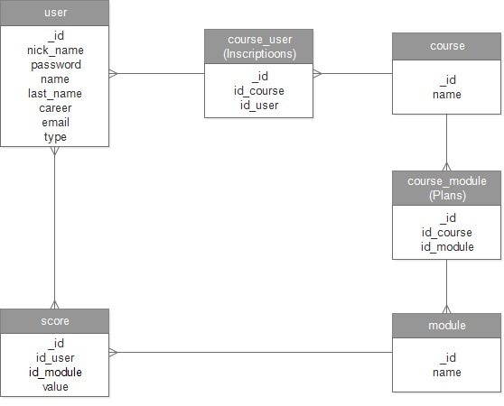

## Usage (Execute)

Here there are some UI screens.
(note: In this page is shown only some screens.)

### Login

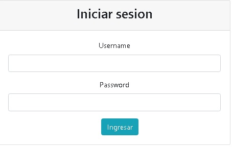

### Nav bar

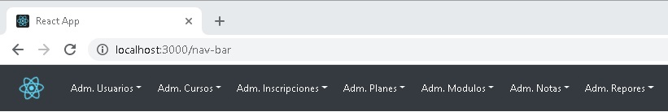

### Users table

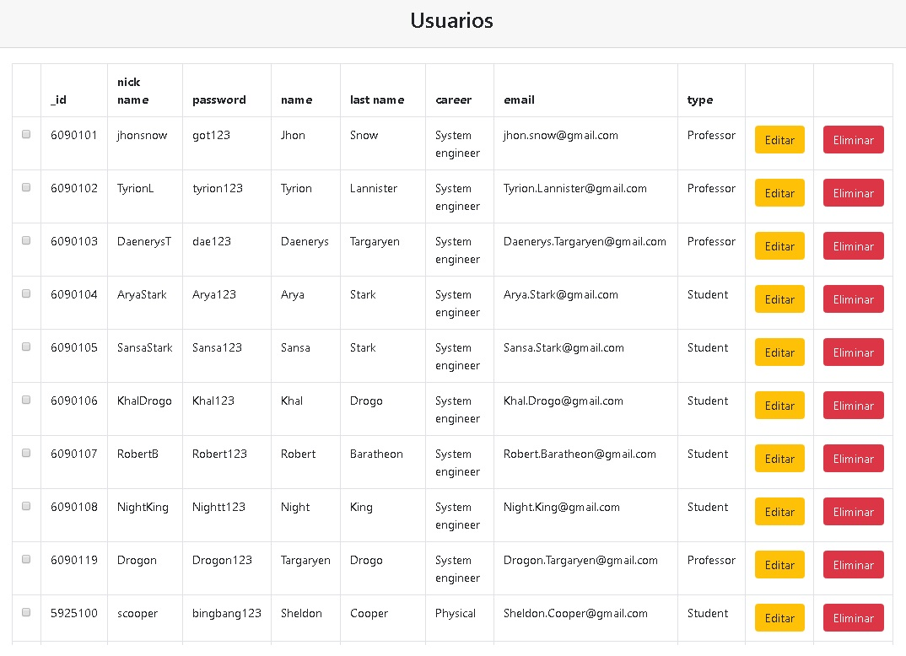

### Users Form

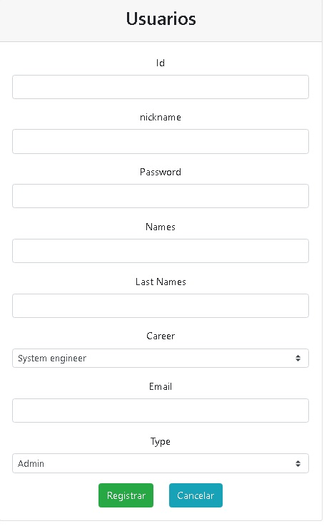

### Courses table

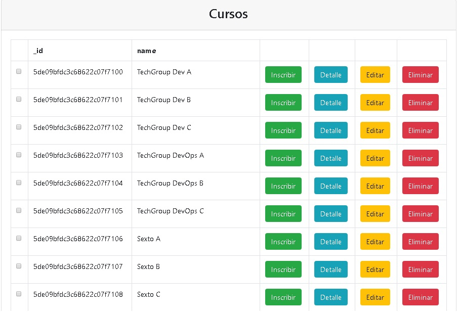

### Courses Form

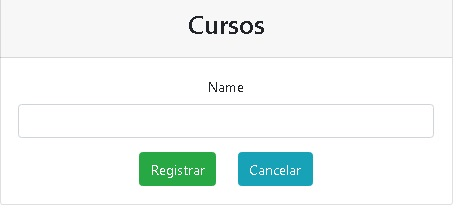

### Module table

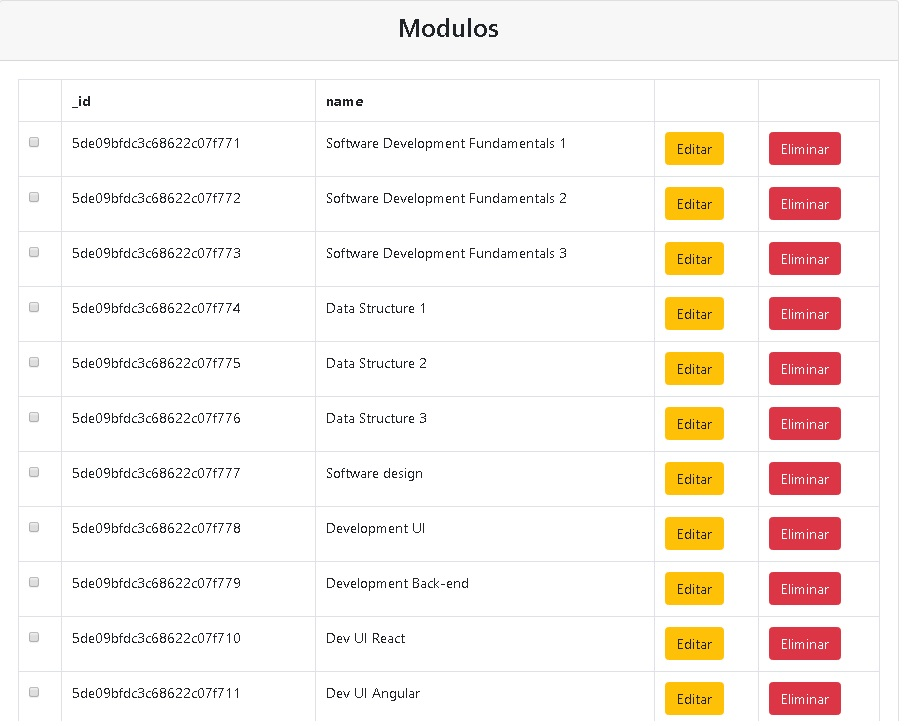

### Module Form

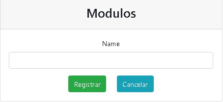

### Inscriptions table

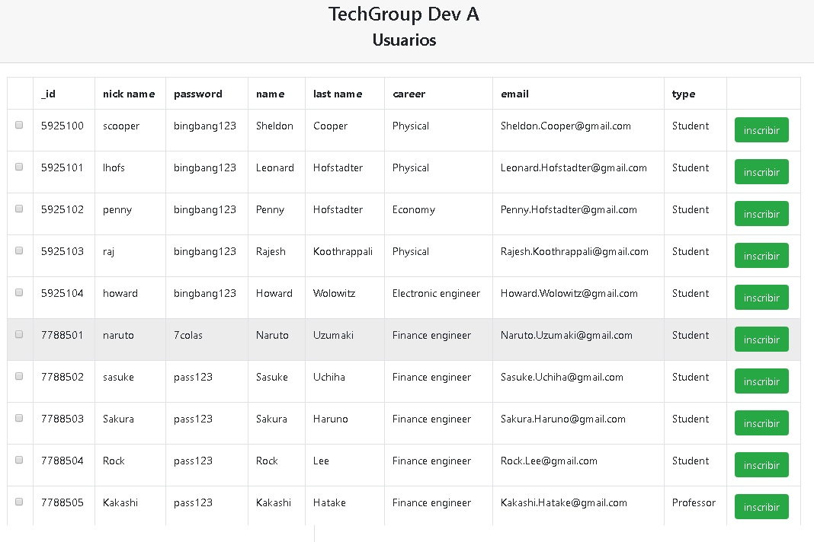

### Plans Table

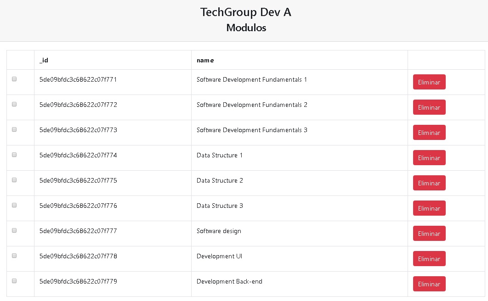

### Scores table

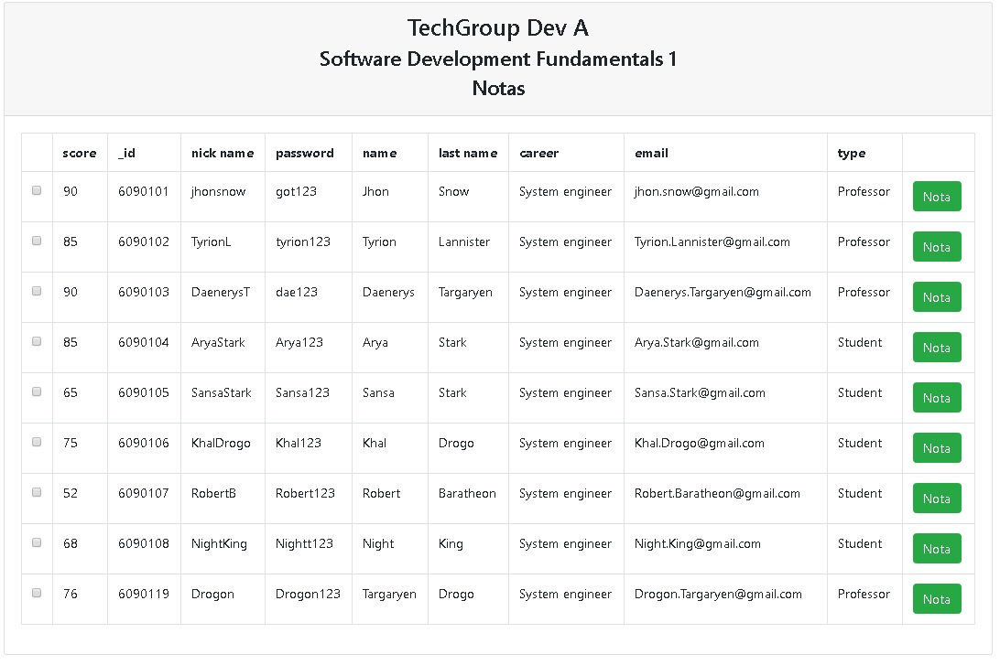
