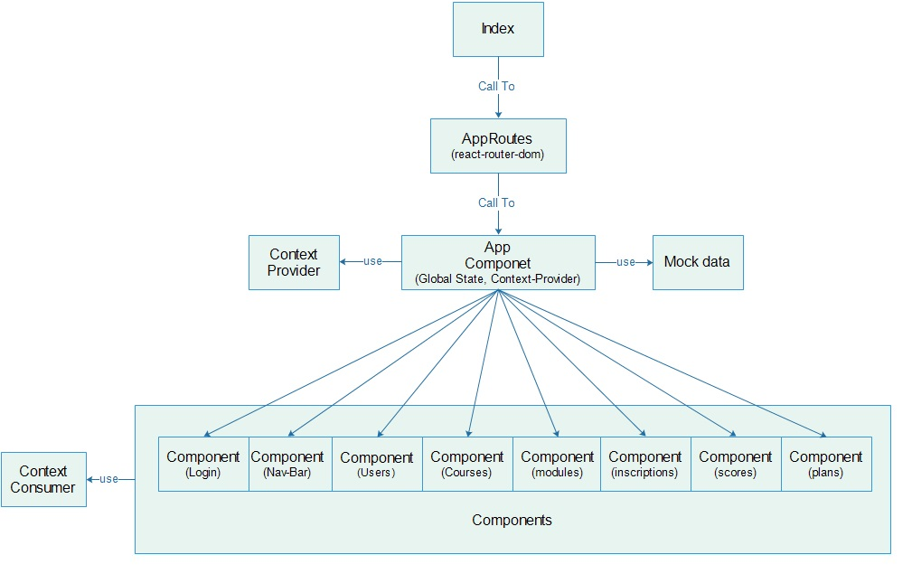

# Javascript-react-edu

1. This project was bootstrapped with [Create React App](https://github.com/facebookincubator/create-react-app).
2. This project is using react 16.12.0.
3. This project is using context global state.
4. This project is using bootstrap for UI style.

## Prerequisites

1. Install Windows 10
2. Install node.js version 8.9.4 or v10.16.3
3. Install npm version 5.6.0 or 6.9.0
4. Install google Chrome 64 Bits Version 64.0

## Deploy

1. do git clone from: https://github.com/RichardSeverich/javascript-react-edu
2. install dependencies: npm install
3. deploy: npm start
4. deploy will start with mock data.
5. default credentials: User: admin, Password: admin123

## Documentation

### Diagram-architecture

### Diagram-entity-relation

  

## Usage (Execute)

Here there are some UI screens.
(note: In this page is shown only some screens.)

### Login

  

### Nav bar

  

### Users table

### Users Form

  

### Courses table

### Courses Form

  

### Module table

### Module Form

  

### Inscriptions table

### Plans Table

### Scores table

